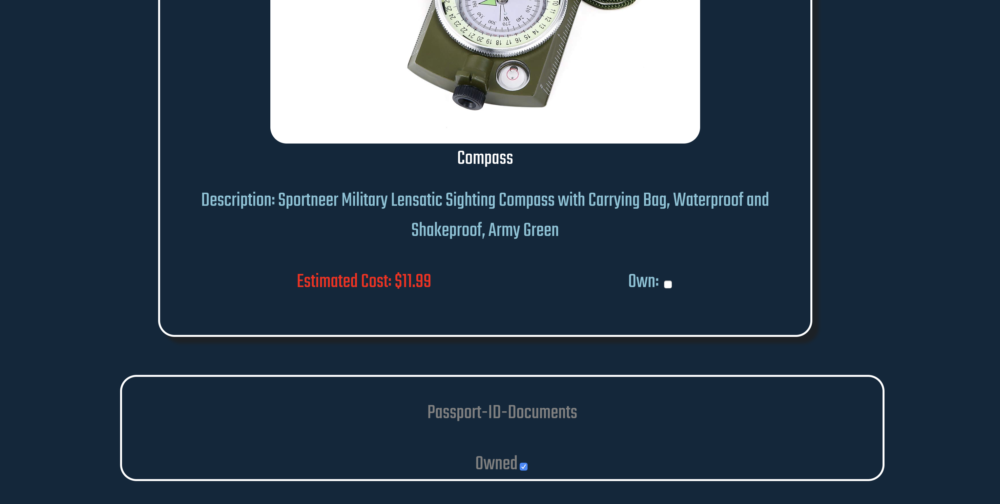

# Bug Out Ready -- https://bug-out-ready.wjacobs710.now.sh/

Things don't always go as planned. You can't bre ready for everything. You can however be ready for some common natural disasters and emergencies in general. This app is meant to be a starting point. A catalyst for though about what would you do in those situations? Would you be ready?

## Sign in

In this app there is a demo mode with a User Name: Ready, with Password: Go.

You have the option to have multiple bags incase you would like to have one for the car and maybe one for a specific emergency. 

## ScreenShots

## Technical Info and Startup
This application was built using react,  html, css, jest, vanilla JS, and JWT for the client side tech stack. Express, Postgresql, supertest, mocha, chai, postgrator bcrypt and JWT are used on the  server side to authenticate, handle requests and build the database. 

This app on a base level uses Browser Router to handle URL switches with the routes being contained in the routes folder in src. The other primary components( forms, items, bags, etc..) are stored in the src folder. 

This app is made to demo purposes and is only expected to be used to show knowledge and was not intended to be re-used for other purposes. With that said, as a developer if you see something you would like clarity on or would like to include in a project of your own please message me for information. 

If you would like to try the application locally simply clone the repos, run NPM INSTALL and begin.
Client Repo: https://github.com/wjacobs71086/Bug-Out-Ready-Client.git
API Repo: https://github.com/wjacobs71086/Bug-Out-Ready-Server.git

## Disclaimer

This is not meant to be a perfect list and is far from it. Add your own flair to your personal bag and feel free to reach out with items you'd like to see added and why. 